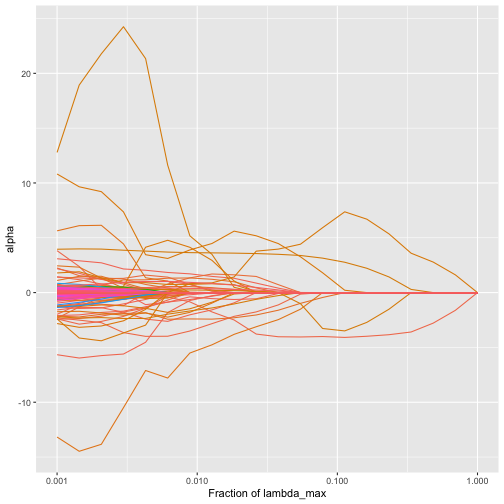

# trac-m2 for regression: a second stage and additional covariates

Here we extend a `trac` regression model with additional
non-compositional covariates, and a second stage that expresses the
model in terms of pairwise log-ratios. The model with covariates is
called trac-m, the model with a second stage trac-2, and the model with
both trac-m2. We use the Central Park Soil data set, one of the examples
in the [trac
paper](https://www.biorxiv.org/content/10.1101/2020.09.01.277632v1.full),
which is included in the `trac` package as `cps_moisture`. The task is
to predict the moisture of soil samples from their bacterial composition
and from five other soil properties. For more on this data set, see
[`?cps_moisture`](https://viettran.de/trac/reference/cps_moisture.md),
and for the basics of `trac`, see [Using `trac` to build tree-aggregated
predictive models](https://viettran.de/trac/articles/trac-example.md).

The `cps_moisture` object has the same elements as the `sCD14` object of
the basic vignette, plus a data frame of covariates:

``` r

library(trac)
library(tidyverse)

names(cps_moisture)
#> [1] "y"          "x"          "tree"       "tax"        "A"          "covariates"
```

The leaves of the tree are bacterial families. The data frame
`covariates` contains the soil pH, total carbon (C), total nitrogen (N),
their ratio (CN) and CO2_C for the same samples.

### Train-test split and preprocessing

We take 2/3 of the observations for training and take the log of the
feature matrix.

``` r

set.seed(123)
ntot <- length(cps_moisture$y)
n <- round(2/3 * ntot)
tr <- sample(ntot, n)
log_pseudo <- function(x, pseudo_count = 1) log(x + pseudo_count)
ytr <- cps_moisture$y[tr]
yte <- cps_moisture$y[-tr]
ztr <- log_pseudo(cps_moisture$x[tr, ])
zte <- log_pseudo(cps_moisture$x[-tr, ])
```

### Prepare the additional covariates

We preprocess the additional covaraites, using the training set only.
`C`, `N` and `CN` are missing for a few samples, and we replace those
values by the median of the training set. Then we standardize all five
covariates with the means and standard deviations of the training set,
so that their coefficients are on the same scale.

``` r

covariates_tr <- cps_moisture$covariates[tr, ]
covariates_te <- cps_moisture$covariates[-tr, ]

# Median imputation
for (v in names(covariates_tr)) {
  med <- median(covariates_tr[[v]], na.rm = TRUE)
  covariates_tr[[v]][is.na(covariates_tr[[v]])] <- med
  covariates_te[[v]][is.na(covariates_te[[v]])] <- med
}

# Standardize the metadata
means <- colMeans(covariates_tr)
sds <- apply(covariates_tr, 2, sd)

covariates_tr <- as.data.frame(scale(covariates_tr, center = means, scale = sds))
covariates_te <- as.data.frame(scale(covariates_te, center = means, scale = sds))
```

### trac without the covariates

As a reference, we first fit `trac` on the microbiome alone and choose
the tuning parameter with the 1SE rule.

``` r

fit <- trac(ztr, ytr, A = cps_moisture$A, min_frac = 1e-3, nlam = 20)
cvfit <- cv_trac(fit, Z = ztr, y = ytr, A = cps_moisture$A)
#> fold 1
#> fold 2
#> fold 3
#> fold 4
#> fold 5

show_nonzeros <- function(x) x[x != 0]
show_nonzeros(fit[[1]]$alpha[, cvfit$cv[[1]]$i1se])
#>                         'Life::k__Bacteria::p__Planctomycetes'                         'Life::k__Bacteria::p__Actinobacteria' 
#>                                                     -1.1148554                                                     -3.5783629 
#>  'Life::k__Bacteria::p__Gemmatimonadetes::c__Gemmatimonadetes'  'Life::k__Bacteria::p__Acidobacteria::c__DA052::o__Ellin6513' 
#>                                                     -1.8748086                                                      0.7472584 
#> 'Life::k__Bacteria::p__Proteobacteria::c__Deltaproteobacteria'  'Life::k__Bacteria::p__Proteobacteria::c__Betaproteobacteria' 
#>                                                      0.2088524                                                     -0.2746696 
#>                         'Life::k__Bacteria::p__Proteobacteria'                                            'Life::k__Bacteria' 
#>                                                     10.9996566                                                     -5.1130709
```

``` r

yhat_te <- predict_trac(fit, new_Z = zte)
testerr <- colMeans((yhat_te[[1]] - yte)^2)
nnz <- colSums(fit[[1]]$alpha != 0)
```

### Additional covariates (trac-m)

`trac` can include non-compositional covariates in the model. They enter
as ordinary linear terms, they are not part of the zero-sum constraint,
and their penalty weights are set with `w_additional_covariates`.
Smaller weights let the covariates enter the model more easily. Here we
use 0.1, as in the trac-m paper.

``` r

fit_cov <- trac(ztr, ytr, A = cps_moisture$A,
                additional_covariates = covariates_tr,
                w_additional_covariates = rep(0.1, ncol(covariates_tr)),
                min_frac = 1e-3, nlam = 20)
plot_trac_path(fit_cov)
```



plot of chunk plot_trac_m2_cps_path

The covariates are also be passed to `cv_trac`. We use the same folds as
for `trac` above, so that both models are tuned on the same folds:

``` r

cvfit_cov <- cv_trac(fit_cov, Z = ztr, y = ytr, A = cps_moisture$A,
                     additional_covariates = covariates_tr,
                     folds = cvfit$folds)
#> fold 1
#> fold 2
#> fold 3
#> fold 4
#> fold 5
alpha_cov <- fit_cov[[1]]$alpha[, cvfit_cov$cv[[1]]$i1se]
show_nonzeros(alpha_cov)
#>                                            'Life::k__Bacteria::p__Planctomycetes' 
#>                                                                     -3.808249e+00 
#>                                               'Life::k__Bacteria::p__Chloroflexi' 
#>                                                                      1.621437e+00 
#> 'Life::k__Bacteria::p__Bacteroidetes::c__Sphingobacteriia::o__Sphingobacteriales' 
#>                                                                     -2.166424e+00 
#>    'Life::k__Bacteria::p__Actinobacteria::c__Acidimicrobiia::o__Acidimicrobiales' 
#>                                                                     -9.351910e-01 
#>                                            'Life::k__Bacteria::p__Actinobacteria' 
#>                                                                     -2.496415e+00 
#>                                                     'Life::k__Bacteria::p__WPS-2' 
#>                                                                     -1.037743e+00 
#>                               'Life::k__Bacteria::p__Gemmatimonadetes::c__Gemm-1' 
#>                                                                      9.874737e-01 
#>                     'Life::k__Bacteria::p__Gemmatimonadetes::c__Gemmatimonadetes' 
#>                                                                     -2.296933e+00 
#>                     'Life::k__Bacteria::p__Firmicutes::c__Bacilli::o__Bacillales' 
#>                                                                      2.834938e-01 
#>                     'Life::k__Bacteria::p__Acidobacteria::c__DA052::o__Ellin6513' 
#>                                                                      1.306183e+00 
#>             'Life::k__Bacteria::p__Acidobacteria::c__Acidobacteria-6::o__iii1-15' 
#>                                                                     -6.294894e-01 
#>   'Life::k__Bacteria::p__Proteobacteria::c__Deltaproteobacteria::o__Myxococcales' 
#>                                                                      1.061618e+00 
#>                    'Life::k__Bacteria::p__Proteobacteria::c__Deltaproteobacteria' 
#>                                                                      5.606105e+00 
#>            'Life::k__Bacteria::p__Proteobacteria::c__Betaproteobacteria::o__MND1' 
#>                                                                     -1.287160e-01 
#>                     'Life::k__Bacteria::p__Proteobacteria::c__Betaproteobacteria' 
#>                                                                     -1.463673e-17 
#>                    'Life::k__Bacteria::p__Proteobacteria::c__Gammaproteobacteria' 
#>                                                                      7.236805e-01 
#>                                            'Life::k__Bacteria::p__Proteobacteria' 
#>                                                                      1.427215e+00 
#>                                                               'Life::k__Bacteria' 
#>                                                                      4.819548e-01 
#>                                                                                pH 
#>                                                                      6.816645e-01 
#>                                                                                 C 
#>                                                                      3.599087e+00 
#>                                                                                 N 
#>                                                                      2.981095e-01 
#>                                                                             CO2_C 
#>                                                                      1.801297e-01
```

The coefficients of the covariates come after those of the nodes. Since
we standardized the covariates, each of these coefficients is the change
in predicted moisture per standard deviation of that soil property.

To make predictions:

``` r

yhat_te_cov <- predict_trac(fit_cov, new_Z = zte,
                            new_additional_covariates = covariates_te)
testerr_cov <- colMeans((yhat_te_cov[[1]] - yte)^2)
```

### A second stage with covariates (trac-m2)

A second stage, in the spirit of the log-ratio lasso of Bates and
Tibshirani (2019), expresses the model in terms of pairwise log-ratios:
it forms all log-ratios between the taxa that `trac` selected and runs a
lasso on them, together with the covariates that `trac` selected.

The names of the log-ratios are long, so we print the selected ones as a
table, shortening each taxon to its last two ranks. The rows without a
denominator are covariates.

``` r

options(knitr.kable.NA = "")
show_log_ratios <- function(log_ratios) {
  nz <- show_nonzeros(log_ratios)
  short <- function(x) {
    x <- str_remove_all(x, "'")
    as.character(ifelse(grepl("::", x), str_extract(x, "[^:]+::[^:]+$"), x))
  }
  parts <- str_split_fixed(names(nz), "///", 2)
  tibble(numerator = short(parts[, 1]),
         denominator = na_if(short(parts[, 2]), ""),
         coefficient = unname(nz))
}
selected_covariates <- intersect(names(show_nonzeros(alpha_cov)), colnames(covariates_tr))
two_stage_cov <- second_stage(Z = ztr, A = cps_moisture$A, y = ytr, betas = alpha_cov,
                              additional_covariates =
                                covariates_tr[, selected_covariates, drop = FALSE],
                              w_additional = 0.1, method = "regr",
                              folds = cvfit$folds)
show_log_ratios(two_stage_cov$log_ratios) %>%
  knitr::kable(digits = 2)
```

| numerator | denominator | coefficient |
|:---|:---|---:|
| k\_\_Bacteria::p\_\_Chloroflexi | c\_\_Acidimicrobiia::o\_\_Acidimicrobiales | 1.14 |
| c\_\_Sphingobacteriia::o\_\_Sphingobacteriales | p\_\_Gemmatimonadetes::c\_\_Gemm-1 | -0.15 |
| k\_\_Bacteria::p\_\_WPS-2 | c\_\_DA052::o\_\_Ellin6513 | -0.54 |
| p\_\_Gemmatimonadetes::c\_\_Gemm-1 | c\_\_Acidobacteria-6::o\_\_iii1-15 | 0.05 |
| c\_\_Acidimicrobiia::o\_\_Acidimicrobiales | c\_\_Deltaproteobacteria::o\_\_Myxococcales | -0.04 |
| p\_\_Gemmatimonadetes::c\_\_Gemmatimonadetes | c\_\_Deltaproteobacteria::o\_\_Myxococcales | -1.25 |
| k\_\_Bacteria::p\_\_Planctomycetes | p\_\_Proteobacteria::c\_\_Deltaproteobacteria | -1.69 |
| c\_\_Acidimicrobiia::o\_\_Acidimicrobiales | p\_\_Proteobacteria::c\_\_Deltaproteobacteria | -1.22 |
| c\_\_Acidimicrobiia::o\_\_Acidimicrobiales | p\_\_Proteobacteria::c\_\_Gammaproteobacteria | -0.46 |
| pH |  | 0.99 |
| C |  | 3.78 |
| N |  | 0.48 |
| CO2_C |  | 0.26 |

Each log-ratio’s coefficient multiplies the log of the ratio of the
geometric means of the numerator and denominator taxa (the full names
are in `two_stage_cov$index`). A positive coefficient means that a
larger ratio of numerator to denominator predicts wetter soil.

We make predictions on the test set with `predict_second_stage`:

``` r

yhat_te_two_cov <- predict_second_stage(
  new_Z = zte,
  new_additional_covariates = covariates_te[, selected_covariates, drop = FALSE],
  fit = two_stage_cov
)
```

Without covariates, the same function gives a second stage for the
microbiome-only `trac` model above (trac-2):

``` r

two_stage <- second_stage(Z = ztr, A = cps_moisture$A, y = ytr,
                          betas = fit[[1]]$alpha[, cvfit$cv[[1]]$i1se],
                          method = "regr", folds = cvfit$folds)
yhat_te_two <- predict_second_stage(new_Z = zte, fit = two_stage)
show_log_ratios(two_stage$log_ratios) %>%
  knitr::kable(digits = 2)
```

| numerator | denominator | coefficient |
|:---|:---|---:|
| k\_\_Bacteria::p\_\_Actinobacteria | p\_\_Proteobacteria::c\_\_Deltaproteobacteria | -0.84 |
| p\_\_Gemmatimonadetes::c\_\_Gemmatimonadetes | p\_\_Proteobacteria::c\_\_Deltaproteobacteria | -1.41 |
| p\_\_Gemmatimonadetes::c\_\_Gemmatimonadetes | k\_\_Bacteria::p\_\_Proteobacteria | -0.52 |

### Comparing the models

Finally, we collect the test errors and the sizes of the models.

``` r

n_taxa_ratios <- function(two_stage) {
  ratios <- names(show_nonzeros(two_stage$log_ratios))
  ratios <- ratios[grepl("///", ratios)]
  c(taxa = length(unique(unlist(strsplit(ratios, "///")))),
    log_ratios = length(ratios))
}
n_cov <- function(two_stage) {
  sum(names(show_nonzeros(two_stage$log_ratios)) %in% colnames(covariates_tr))
}
i1se <- cvfit$cv[[1]]$i1se
i1se_cov <- cvfit_cov$cv[[1]]$i1se
fit_lm <- lm(ytr ~ ., data = covariates_tr)
testerr_mean <- mean((mean(ytr) - yte)^2)
tibble(
  model = c("trac", "trac-2", "covariates only (linear model)", "trac-m", "trac-m2",
            "training mean"),
  taxa = c(nnz[i1se], n_taxa_ratios(two_stage)["taxa"], 0,
           sum(fit_cov[[1]]$alpha[seq_len(ncol(cps_moisture$A)), i1se_cov] != 0),
           n_taxa_ratios(two_stage_cov)["taxa"], 0),
  log_ratios = c(NA, n_taxa_ratios(two_stage)["log_ratios"], NA, NA,
                 n_taxa_ratios(two_stage_cov)["log_ratios"], NA),
  covariates = c(0, 0, ncol(covariates_tr), length(selected_covariates),
                 n_cov(two_stage_cov), 0),
  test_error = c(testerr[i1se], mean((yhat_te_two - yte)^2),
                 mean((predict(fit_lm, newdata = covariates_te) - yte)^2),
                 testerr_cov[i1se_cov], mean((yhat_te_two_cov - yte)^2), testerr_mean)
) %>%
  mutate(r_squared = 1 - test_error / testerr_mean) %>%
  knitr::kable(digits = c(0, 0, 0, 0, 1, 2))
```

| model | taxa | log_ratios | covariates | test_error | r_squared |
|:---|---:|---:|---:|---:|---:|
| trac | 8 |  | 0 | 42.6 | 0.09 |
| trac-2 | 4 | 3 | 0 | 44.2 | 0.05 |
| covariates only (linear model) | 0 |  | 5 | 32.9 | 0.29 |
| trac-m | 18 |  | 4 | 29.3 | 0.37 |
| trac-m2 | 12 | 9 | 4 | 29.8 | 0.36 |
| training mean | 0 |  | 0 | 46.7 | 0.00 |

The microbiome alone predicts soil moisture poorly, and the soil
properties alone predict it moderately. Together, they predict it better
than either. The second stage keeps most of this accuracy with a model
written in terms of a few log-ratios and covariates.
