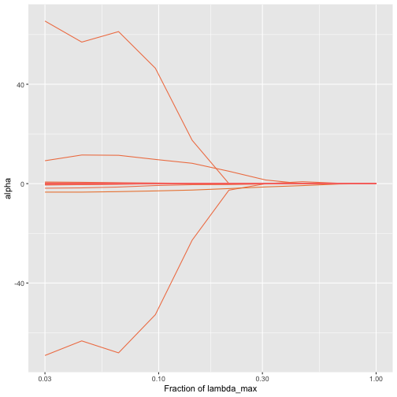
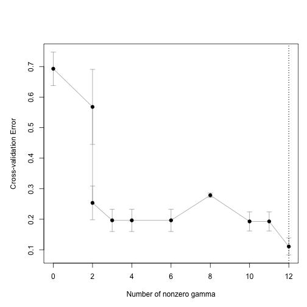
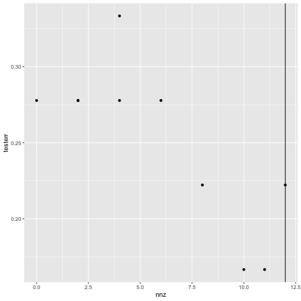
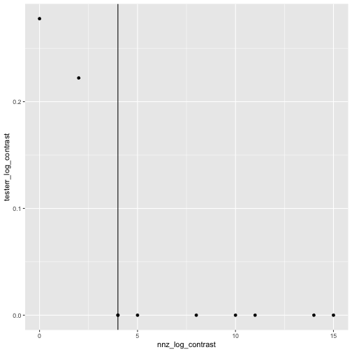

<!--
To knit this vignette, I ran the following within an R console:

knitr::knit("trac-classification-pipeline.Rmd.orig",
output = "trac-classification-pipeline.Rmd")

-->


# trac classification pipeline


``` r
library(tidyverse) # data wrangling and visualization
library(phyloseq) # microbiome data wrangling
library(trac) # trac
library(kableExtra) # creating tables in rmarkdown
```

This tutorial aims to provide insight into a analysis pipeline. We will start with a [phyloseq object](https://joey711.github.io/phyloseq/) [@mcmurdie2013phyloseq]. This `phyloseq object` should contain at least the OTU/ASV counts and the taxonomic assignment for each OTU/ASV.


``` r
knitr::include_graphics("figures/trac_workflow.png")
```

<div class="figure">

<p class="caption">plot of chunk unnamed-chunk-3</p>
</div>

To demonstrate how to use trac, we use the dataset of [@yatsunenko2012human] from the [MLRepo](https://knights-lab.github.io/MLRepo/docs/yatsunenko_malawi_venezuela.html){.uri}. [@vangay2019microbiome]. The given OTU labels are matched with the greengenes 97 database [@mcdonald2012improved]. OTUs appearing in less than 10% of the samples are excluded and only bacteria are included. The concrete `phyloseq object` (`malawi`) contains:

-   `otu_table`: contains 54 observations and 5008 OTUs
-   `tax_table`: contains the taxonomic assignments of the OTUs. The rownames correspond to the columns of the `otu_table`
-   `sam_data`: contains the variable of interest (`Var`) and the additional non-compositional covariates age (numeric) and sex (factor)

This vignette covers the preprocessing and the first stage of the trac-m workflow: `trac` and sparse log-contrast models for the microbiome alone.  The additional covariates, a second stage with pairwise log-ratios and inference on held-out data are shown in [trac-m2 for classification](trac-m2-classification.html).


``` r
data("malawi")
```

# Preprocessing steps for trac

## Create A matrix and generate tree

The workflow to generate the A matrix based on the `phyloseq` object could be:

1.  Extract the taxonomic table from the `phyloseq` object.
2.  Optional: add OTU/ASV level to the taxonomic table.
3.  Replace unknown taxonomic assignments on different levels, for example, by a number. This prevents the data with unknown taxonomic assignments from being thrown together.
4.  Add ancestor information --\> helpful for reporting the results
5.  Build tree with `tax_table_to_phylo`. This is also helpful to visualize the results at the end.
6.  Call `phylo_to_A` to generate the A matrix


``` r
# 1. extract the taxonomic table from the phyloseq object
tax <- malawi@tax_table@.Data

# 2. add an OTU column based on the rownames and name the column OTU
tax <- cbind(tax, rownames(tax))
colnames(tax)[ncol(tax)] <- "OTU"
# In this example is rooted in bacteria since we only consider bacteria. If one also wants to
# include archea one needs to add another root node e.g. cbind(root = "life", tax). Need to
# adjust the for loops in the next steps and add the root to the formula in step 5

# 3. Replace unknown taxonomic assignement on the corresponding level
# iterate over all levels
for (i in seq_len(7)) {
  # add a number when the type is unknown... e.g. "g__"
  ii <- nchar(tax[, i]) == 3
  if (sum(ii) > 0)
    tax[ii, i] <- paste0(tax[ii, i], 1:sum(ii))
}

# 4. add the ancestor information with ::
# iterate over all levels
for (i in 2:8) {
  tax[, i] <- paste(tax[, i-1], tax[, i], sep = "::")
}
tax <- as.data.frame(tax, stringsAsFactors = TRUE)

# 5. form phylo object:
tree1 <- tax_table_to_phylo(~Kingdom/Phylum/Class/Order/
                              Family/Genus/Species/OTU,
                            data = tax, collapse = TRUE)

# 6. convert this to an A matrix to be used for aggregation:
A <- phylo_to_A(tree1)
```

## Pseudo-count + log transformation

trac expects log transformed values as inputs. Since $log(0)$ is undefined we need to add a pseudo-count (e.g. 1)


``` r
log_pseudo <- function(x, pseudo_count = 1) log(x + pseudo_count)
z <- log_pseudo(malawi@otu_table@.Data)
```

## Align the columns of z with the rows of A

`tax_table_to_phylo` orders the leaves by the tree, so the rows of `A` are not in the column order of the OTU table. `trac` pairs column $j$ of `z` with row $j$ of `A` without checking names; a misaligned model still fits and can even predict well, but its clades are built from the wrong OTUs. The rownames of `A` end in the OTU id, so reorder `z` and check it:


``` r
leaf_otu <- sub(".*::", "", rownames(A))
z <- z[, match(leaf_otu, colnames(z))]
stopifnot(identical(colnames(z), leaf_otu))
```

# Model fitting

## Train-test split

First we split the data into a train-test split to evaluate the predictive performance at the end. Other more advanced methods can be used as well.


``` r
# extact the label
y <- malawi@sam_data$Var
# transform depended variable to -1 and 1
y <- (y == "Malawi") * 2 - 1

# define seed for reproducibility
set.seed(1)
# train test split
ntot <- length(y)
n <- round(2/3 * ntot)
tr <- sample(ntot, n)
# define training and test data
ytr <- y[tr]
yte <- y[-tr]
ztr <- z[tr, ]
zte <- z[-tr, ]
```

## Fit model: Classification with squared hinge loss

We will fit the model on the train data. The task is to predict if the person lives in Venezuela or Malawi therefore a binary classification task. Specify this by the argument `method`. The method will solve the lambda path and selecting the optimal tuning parameter $\lambda$. The path for the coefficient can be plotted with `plot_trac_path`.


``` r
# fit trac with c1
fit <- trac(ztr, ytr, A = A, min_frac = 3e-2, nlam = 10, method = "classif")
plot_trac_path(fit)
```



As a baseline we can fit a sparse log-contrast model on the OTU level as well.


``` r
fit_log_contrast <-
  sparse_log_contrast(Z = ztr, y = ytr, min_frac = 3e-2,
                      nlam = 10, method = "classif")
```

One can usually not scale the compositional data, but an alternative is to set penalty weights, such that the sparse log-contrast model does not favours taxa whose log-abundances vary a lot, because they can enter with small coefficients. Weighting each taxon's penalty by its standard deviation in the training data is the same as standardising the taxa, while the zero-sum constraint stays on the original coefficients. `sparse_log_contrast()` has no argument for weights on the taxa. The same model is `trac()` with an identity aggregation matrix, whose argument `w` sets one penalty weight per taxon; with `w` left at 1 it reproduces `sparse_log_contrast()` exactly.


``` r
# trac centres each sample (clr), so take the standard deviations after centring
w_taxa <- apply(ztr - rowMeans(ztr), 2, sd)
A_leaf <- as(Matrix::Diagonal(ncol(ztr)), "CsparseMatrix")
dimnames(A_leaf) <- list(colnames(ztr), colnames(ztr))
fit_log_contrast_fair <-
  trac(ztr, ytr, A = A_leaf, w = w_taxa,
       min_frac = 3e-2, nlam = 10, method = "classif")
```

## Find optimal hyper-parameter

The optimal $\lambda$ can be determined with cross-validation for each model.


``` r
set.seed(1)
# run cross validation
cvfit <- cv_trac(fit, Z = ztr, y = ytr, A = A)
#> fold 1
#> fold 2
#> fold 3
#> fold 4
#> fold 5
plot_cv_trac(cvfit)
```




``` r
set.seed(1)
cvfit_log_contrast <-
  cv_sparse_log_contrast(fit_log_contrast, Z = ztr, y = ytr)
#> fold 1
#> fold 2
#> fold 3
#> fold 4
#> fold 5
set.seed(1)
cvfit_log_contrast_fair <-
  cv_trac(fit_log_contrast_fair, Z = ztr, y = ytr, A = A_leaf)
#> fold 1
#> fold 2
#> fold 3
#> fold 4
#> fold 5
```

# Reporting

## Evaluation of predictive performance


``` r
# get predicted values

# trac
yhat_te <- predict_trac(fit, new_Z = zte)
# sparse log-contrast classification
yhat_te_log_contrast <-
  predict_trac(list(fit_log_contrast), new_Z = zte)

# calculate missclassification error for each methods
# trac classification
testerr <- colMeans(sign(yhat_te[[1]]) != yte)
nnz <- colSums(fit[[1]]$alpha != 0)

# sparse log-contrast classification
testerr_log_contrast <- colMeans(sign(yhat_te_log_contrast[[1]]) != yte)
nnz_log_contrast <- colSums(fit_log_contrast$beta != 0)
```


``` r
# plot missclassification error of test split based on number of
# selected taxa (trac)
tibble(nnz = nnz, testerr = testerr) %>%
  ggplot(aes(x = nnz, y = testerr)) +
  geom_point() +
  geom_vline(xintercept = nnz[cvfit$cv[[1]]$i1se])
```




``` r
# plot missclassification error of test split based on number of
# selected taxa (sparse log contrast)
tibble(nnz = nnz_log_contrast, testerr = testerr_log_contrast) %>%
  ggplot(aes(x = nnz_log_contrast, y = testerr_log_contrast)) +
  geom_point() +
  geom_vline(xintercept = nnz_log_contrast[cvfit_log_contrast$cv$i1se])
```



Fair selection changes which taxa enter the sparse log-contrast model. At the minimum cross-validation error, the unweighted model picks taxa with a much larger spread than the typical taxon with the standard-deviation weights the selected taxa are less extreme.


``` r
selected <- function(b) names(b)[b != 0]
i_slc <- cvfit_log_contrast$cv$ibest
i_fair <- cvfit_log_contrast_fair$cv[[1]]$ibest
sel_slc <- selected(fit_log_contrast$beta[, i_slc])
sel_fair <- selected(fit_log_contrast_fair[[1]]$beta[, i_fair])
yhat_te_fair <- predict_trac(fit_log_contrast_fair, new_Z = zte)[[1]][, i_fair]
tibble(model = c("sparse log-contrast", "sparse log-contrast, fair weights"),
       selected_taxa = c(length(sel_slc), length(sel_fair)),
       median_sd_of_selected = c(median(w_taxa[sel_slc]), median(w_taxa[sel_fair])),
       test_error = c(mean(sign(yhat_te_log_contrast[[1]][, i_slc]) != yte),
                      mean(sign(yhat_te_fair) != yte))) %>%
  kable(digits = 2)
```


|model                             | selected_taxa| median_sd_of_selected| test_error|
|:---------------------------------|-------------:|---------------------:|----------:|
|sparse log-contrast               |             5|                  3.26|          0|
|sparse log-contrast, fair weights |             3|                  2.64|          0|


## Reporting of Results

The following code shows an example on how to extract the selected components based on the fitted trac object.


``` r
# define the different taxonomic ranks
rank_names <- c("Kingdom",
                "Phylum",
                "Class",
                "Order",
                "Family",
                "Genus",
                "Species")

# get non-zero alphas
show_nonzeros <- function(x){
  enframe(x[x != 0]) %>%
    mutate(name = str_remove_all(name, "[a-z]__"),
           name = str_remove_all(name, "'")) %>%
    separate(name, into = rank_names, sep = "::", fill = "right") %>%
    mutate(across(where(is.character), ~replace_na(.x, " "))) %>%
    arrange(value) %>%
    rename(alpha = value)
}
show_nonzeros(fit[[1]]$alpha[, cvfit$cv[[1]]$i1se]) %>%
  kable()
```


|Kingdom  |Phylum         |Class       |Order         |Family          |Genus       |Species |       alpha|
|:--------|:--------------|:-----------|:-------------|:---------------|:-----------|:-------|-----------:|
|Bacteria |Firmicutes     |Clostridia  |Clostridiales |                |            |        | -69.1706599|
|Bacteria |Proteobacteria |            |              |                |            |        |  -3.4144062|
|Bacteria |Firmicutes     |Clostridia  |Clostridiales |Ruminococcaceae |            |        |  -1.8339628|
|Bacteria |Bacteroidetes  |Bacteroidia |Bacteroidales |Bacteroidaceae  |            |        |  -0.5743973|
|Bacteria |Firmicutes     |Clostridia  |Clostridiales |Lachnospiraceae |Coprococcus |        |  -0.3839477|
|Bacteria |Bacteroidetes  |Bacteroidia |Bacteroidales |                |            |        |  -0.3649045|
|Bacteria |Firmicutes     |Clostridia  |Clostridiales |Lachnospiraceae |            |        |  -0.1604407|
|Bacteria |Firmicutes     |Clostridia  |Clostridiales |Veillonellaceae |            |        |   0.2372019|
|Bacteria |Tenericutes    |Mollicutes  |              |                |            |        |   0.3190155|
|Bacteria |Firmicutes     |Clostridia  |Clostridiales |Clostridiaceae  |            |        |   0.6669931|
|Bacteria |Firmicutes     |            |              |                |            |        |   9.2275209|
|Bacteria |Firmicutes     |Clostridia  |              |                |            |        |  65.4519877|


## Next steps

To add the covariates age and sex to the model, to express it in terms of pairwise log-ratios with a second stage and to estimate the effects of these log-ratios on held-out data, continue with [trac-m2 for classification](trac-m2-classification.html).

# References
