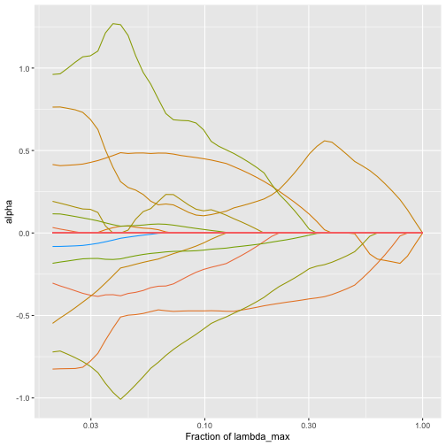

<!--
To knit this vignette, I ran the following within an R console:

knitr::knit("trac-m2-classification.Rmd.orig", output = "trac-m2-classification.Rmd")

-->


---
title: "Untitled"
output: html_document
date: "2026-10-09"
---

This vignette extends the [trac classification pipeline](trac-classification-pipeline.html), which shows how to prepare the `malawi` data for `trac` and compares `trac` with sparse log-contrast models.  Here we show the remaining steps of the trac-m workflow for a binary outcome: additional non-compositional covariates (trac-m), a second stage that expresses the model in terms of pairwise log-ratios (trac-m2), and a third stage that estimates the effects of the selected log-ratios on held-out data.  The data are stool samples of adults living in Malawi or Venezuela from [Yatsunenko et al. (2012)](https://www.ncbi.nlm.nih.gov/pmc/articles/PMC3376388/), as prepared for the [Microbiome Learning Repo](https://knights-lab.github.io/MLRepo/docs/yatsunenko_malawi_venezuela.html), and the task is to predict the country from the gut bacteria and from the age and sex of the participants.  For more on this data set, see `?malawi`, and for the first two stages with a continuous response, see [trac-m2 for regression](trac-m2-regression.html).


``` r
library(trac)
library(phyloseq)
library(tidyverse)
options(knitr.kable.NA = "")
malawi
#> phyloseq-class experiment-level object
#> otu_table()   OTU Table:         [ 5008 taxa and 54 samples ]
#> sample_data() Sample Data:       [ 54 samples by 3 sample variables ]
#> tax_table()   Taxonomy Table:    [ 5008 taxa by 7 taxonomic ranks ]
```

`trac` expects the two classes to be coded as -1 and 1.  We code the participants from Malawi as 1:


``` r
sample_info <- data.frame(malawi@sam_data)
y <- ifelse(sample_info$Var == "Malawi", 1, -1)
table(y)
#> y
#> -1  1 
#> 33 21
```

### Aggregate to the genus level

`malawi` holds the counts of 5008 OTUs.  As in the classification pipeline, we build the tree and the matrix `A` from the taxonomy table.  Here we label the ranks without an assignment (e.g. `g__`) as unclassified, so that the OTUs without a genus assignment are pooled within their family instead of being numbered one by one, and we sum the counts to the genus level with `aggregate_to_level`, which keeps the example small.


``` r
x <- malawi@otu_table@.Data
tax <- malawi@tax_table@.Data
blank <- nchar(tax) == 3
tax[blank] <- paste0(tax[blank], "unclassified")
tax <- cbind(tax, OTU = rownames(tax))
for (i in 2:8) tax[, i] <- paste(tax[, i - 1], tax[, i], sep = "::")
tax <- as.data.frame(tax, stringsAsFactors = TRUE)
tree <- tax_table_to_phylo(~Kingdom/Phylum/Class/Order/Family/Genus/Species/OTU,
                           data = tax, collapse = TRUE)
A <- phylo_to_A(tree)
x <- x[, match(sub(".*::", "", rownames(A)), colnames(x))]
genus <- aggregate_to_level(x, y, A, tax, level = 6, collapse = TRUE)
x_genus <- as.matrix(genus$x)[, rownames(genus$A)]
A_genus <- genus$A
dim(x_genus)
#> [1]  54 272
```

### Preprocessing

The test set has two roles here: we compare the predictions of the models on it, and in the last section we use it to estimate the effects of the selected log-ratios.  Since the data set is small, we keep half of the participants for testing.


``` r
set.seed(123)
ntot <- length(y)
n <- round(1/2 * ntot)
tr <- sample(ntot, n)
log_pseudo <- function(x, pseudo_count = 1) log(x + pseudo_count)
ytr <- y[tr]
yte <- y[-tr]
ztr <- log_pseudo(x_genus[tr, ])
zte <- log_pseudo(x_genus[-tr, ])
```

### Prepare the covariates


``` r
covariates <- data.frame(
  age = sample_info$age,
  male = ifelse(sample_info$sex == "unknown", NA, as.numeric(sample_info$sex == "male"))
)
covariates_tr <- covariates[tr, ]
covariates_te <- covariates[-tr, ]
for (v in names(covariates_tr)) {
  med <- median(covariates_tr[[v]], na.rm = TRUE)
  covariates_tr[[v]][is.na(covariates_tr[[v]])] <- med
  covariates_te[[v]][is.na(covariates_te[[v]])] <- med
}
means <- colMeans(covariates_tr)
sds <- apply(covariates_tr, 2, sd)
covariates_tr <- as.data.frame(scale(covariates_tr, center = means, scale = sds))
covariates_te <- as.data.frame(scale(covariates_te, center = means, scale = sds))
```

### trac without the covariates

As a reference, we first fit `trac` on the microbiome alone.


``` r
fit <- trac(ztr, ytr, A = A_genus, method = "classif", min_frac = 2e-2, nlam = 50)
cvfit <- cv_trac(fit, Z = ztr, y = ytr, A = A_genus)
#> fold 1
#> fold 2
#> fold 3
#> fold 4
#> fold 5
ibest <- cvfit$cv[[1]]$ibest
show_nonzeros <- function(x) x[x != 0]
show_nonzeros(fit[[1]]$alpha[, ibest])
#>                                               'k__Bacteria::p__Proteobacteria::c__Betaproteobacteria' 
#>                                                                                             0.1246306 
#> 'k__Bacteria::p__Proteobacteria::c__Gammaproteobacteria::o__Enterobacteriales::f__Enterobacteriaceae' 
#>                                                                                            -0.4717532 
#>                                                                      'k__Bacteria::p__Proteobacteria' 
#>                                                                                             0.3593646 
#>                                     'k__Bacteria::p__Bacteroidetes::c__Bacteroidia::o__Bacteroidales' 
#>                                                                                            -0.1313935 
#>                                               'k__Bacteria::p__Firmicutes::c__Bacilli::o__Bacillales' 
#>                                                                                            -0.4902757 
#>                      'k__Bacteria::p__Firmicutes::c__Clostridia::o__Clostridiales::f__Clostridiaceae' 
#>                                                                                             0.3904130 
#>                                                           'k__Bacteria::p__Firmicutes::c__Clostridia' 
#>                                                                                             0.2190141
```


``` r
yhat_te <- predict_trac(fit, new_Z = zte)
pROC::auc(yte, yhat_te[[1]][, ibest])
#> Setting levels: control = -1, case = 1
#> Setting direction: controls < cases
#> Area under the curve: 0.9013
```

### Additional covariates (trac-m)

The covariates enter the classification model in the same way as in regression: as ordinary linear terms that are not part of the zero-sum constraint, with penalty weights set by `w_additional_covariates`.  We again use 0.1, as in the trac-m paper.


``` r
fit_cov <- trac(ztr, ytr, A = A_genus, method = "classif",
                additional_covariates = covariates_tr,
                w_additional_covariates = rep(0.1, ncol(covariates_tr)),
                min_frac = 2e-2, nlam = 50)
plot_trac_path(fit_cov)
```



We tune the model on the same folds as `trac` above:


``` r
cvfit_cov <- cv_trac(fit_cov, Z = ztr, y = ytr, A = A_genus,
                     additional_covariates = covariates_tr,
                     folds = cvfit$folds)
#> fold 1
#> fold 2
#> fold 3
#> fold 4
#> fold 5
ibest_cov <- cvfit_cov$cv[[1]]$ibest
alpha_cov <- fit_cov[[1]]$alpha[, ibest_cov]
show_nonzeros(alpha_cov)
#>                                               'k__Bacteria::p__Proteobacteria::c__Betaproteobacteria' 
#>                                                                                            0.08647364 
#> 'k__Bacteria::p__Proteobacteria::c__Gammaproteobacteria::o__Enterobacteriales::f__Enterobacteriaceae' 
#>                                                                                           -0.48665208 
#>                                                                      'k__Bacteria::p__Proteobacteria' 
#>                                                                                            0.48195623 
#>                                     'k__Bacteria::p__Bacteroidetes::c__Bacteroidia::o__Bacteroidales' 
#>                                                                                           -0.16093954 
#>                                               'k__Bacteria::p__Firmicutes::c__Bacilli::o__Bacillales' 
#>                                                                                           -0.47491565 
#>                      'k__Bacteria::p__Firmicutes::c__Clostridia::o__Clostridiales::f__Clostridiaceae' 
#>                                                                                            0.40193058 
#>                                                           'k__Bacteria::p__Firmicutes::c__Clostridia' 
#>                                                                                            0.15214683 
#>                                                                                                   age 
#>                                                                                           -0.08542366
yhat_te_cov <- predict_trac(fit_cov, new_Z = zte,
                            new_additional_covariates = covariates_te)
pROC::auc(yte, yhat_te_cov[[1]][, ibest_cov])
#> Setting levels: control = -1, case = 1
#> Setting direction: controls < cases
#> Area under the curve: 0.8947
```

With the covariates, `trac` selects the same taxa and age, but not sex. Here, age hardly changes the test AUC, since the bacteria already separate the two countries well.

### A second stage with covariates (trac-m2)

The second stage works as in the regression vignette: `second_stage` forms all log-ratios between the taxa that `trac` selected and runs a lasso on them, together with the covariates that `trac` selected.


``` r

show_log_ratios <- function(log_ratios) {
  nz <- show_nonzeros(log_ratios)
  short <- function(x) {
    x <- str_remove_all(x, "'")
    as.character(ifelse(grepl("::", x), str_extract(x, "[^:]+::[^:]+$"), x))
  }
  parts <- str_split_fixed(names(nz), "///", 2)
  tibble(numerator = short(parts[, 1]),
         denominator = na_if(short(parts[, 2]), ""),
         coefficient = unname(nz))
}
selected_covariates <- intersect(names(show_nonzeros(alpha_cov)), colnames(covariates_tr))
two_stage_cov <- second_stage(Z = ztr, A = A_genus, y = ytr, betas = alpha_cov,
                              additional_covariates =
                                covariates_tr[, selected_covariates, drop = FALSE],
                              w_additional = 0.1, method = "classif",
                              folds = cvfit$folds)
show_log_ratios(two_stage_cov$log_ratios) %>%
  knitr::kable(digits = 2)
```


|numerator                                   |denominator                         | coefficient|
|:-------------------------------------------|:-----------------------------------|-----------:|
|o__Enterobacteriales::f__Enterobacteriaceae |k__Bacteria::p__Proteobacteria      |       -2.82|
|p__Proteobacteria::c__Betaproteobacteria    |c__Bacilli::o__Bacillales           |        0.57|
|c__Bacteroidia::o__Bacteroidales            |o__Clostridiales::f__Clostridiaceae |       -1.38|
|c__Bacilli::o__Bacillales                   |o__Clostridiales::f__Clostridiaceae |       -0.82|
|age                                         |                                    |       -0.73|


A positive coefficient means that a larger ratio of numerator to denominator points to Malawi. The rows without a denominator are covariates.


``` r
yhat_te_two_cov <- predict_second_stage(
  new_Z = zte,
  new_additional_covariates = covariates_te[, selected_covariates, drop = FALSE],
  fit = two_stage_cov
)
pROC::auc(yte, yhat_te_two_cov)
#> Setting levels: control = -1, case = 1
#> Warning in roc.default(response, predictor, auc = TRUE, ...): Deprecated use a matrix as predictor. Unexpected results may be
#> produced, please pass a numeric vector.
#> Setting direction: controls < cases
#> Area under the curve: 0.9276
```

Without covariates, the same function gives a second stage for the microbiome-only `trac` model above (trac-2):


``` r
two_stage <- second_stage(Z = ztr, A = A_genus, y = ytr,
                          betas = fit[[1]]$alpha[, ibest],
                          method = "classif", folds = cvfit$folds)
yhat_te_two <- predict_second_stage(new_Z = zte, fit = two_stage)
show_log_ratios(two_stage$log_ratios) %>%
  knitr::kable(digits = 2)
```


|numerator                                   |denominator                                 | coefficient|
|:-------------------------------------------|:-------------------------------------------|-----------:|
|p__Proteobacteria::c__Betaproteobacteria    |o__Enterobacteriales::f__Enterobacteriaceae |        0.22|
|o__Enterobacteriales::f__Enterobacteriaceae |k__Bacteria::p__Proteobacteria              |       -1.10|
|p__Proteobacteria::c__Betaproteobacteria    |c__Bacilli::o__Bacillales                   |        0.02|
|c__Bacteroidia::o__Bacteroidales            |o__Clostridiales::f__Clostridiaceae         |       -0.48|
|c__Bacilli::o__Bacillales                   |o__Clostridiales::f__Clostridiaceae         |       -1.10|


### Comparing the models


``` r
n_taxa_ratios <- function(two_stage) {
  ratios <- names(show_nonzeros(two_stage$log_ratios))
  ratios <- ratios[grepl("///", ratios)]
  c(taxa = length(unique(unlist(strsplit(ratios, "///")))),
    log_ratios = length(ratios))
}
n_cov <- function(two_stage) {
  sum(names(show_nonzeros(two_stage$log_ratios)) %in% colnames(covariates_tr))
}
fit_glm <- glm(malawi ~ ., family = binomial(),
               data = cbind(malawi = as.numeric(ytr == 1), covariates_tr))
scores <- list(trac = yhat_te[[1]][, ibest],
               "trac-2" = yhat_te_two,
               "covariates only (logistic regression)" =
                 predict(fit_glm, newdata = covariates_te),
               "trac-m" = yhat_te_cov[[1]][, ibest_cov],
               "trac-m2" = yhat_te_two_cov)
tibble(
  model = names(scores),
  taxa = c(sum(fit[[1]]$alpha[, ibest] != 0), n_taxa_ratios(two_stage)["taxa"], 0,
           sum(alpha_cov[seq_len(ncol(A_genus))] != 0),
           n_taxa_ratios(two_stage_cov)["taxa"]),
  log_ratios = c(NA, n_taxa_ratios(two_stage)["log_ratios"], NA, NA,
                 n_taxa_ratios(two_stage_cov)["log_ratios"]),
  covariates = c(0, 0, ncol(covariates_tr), length(selected_covariates),
                 n_cov(two_stage_cov)),
  test_auc = sapply(scores, function(score) {
    as.numeric(pROC::auc(response  = yte, predictor = as.numeric(score)))}),
  test_error = sapply(scores, function(score) mean(sign(score) != yte))
) %>%
  knitr::kable(digits = c(0, 0, 0, 0, 2, 2))
#> Setting levels: control = -1, case = 1
#> Setting direction: controls < cases
#> Setting levels: control = -1, case = 1
#> Setting direction: controls < cases
#> Setting levels: control = -1, case = 1
#> Setting direction: controls < cases
#> Setting levels: control = -1, case = 1
#> Setting direction: controls < cases
#> Setting levels: control = -1, case = 1
#> Setting direction: controls < cases
```


|model                                 | taxa| log_ratios| covariates| test_auc| test_error|
|:-------------------------------------|----:|----------:|----------:|--------:|----------:|
|trac                                  |    7|           |          0|     0.90|       0.22|
|trac-2                                |    6|          5|          0|     0.91|       0.19|
|covariates only (logistic regression) |    0|           |          2|     0.75|       0.37|
|trac-m                                |    7|           |          1|     0.89|       0.22|
|trac-m2                               |    6|          4|          1|     0.93|       0.11|


The bacteria predict the country much better than age and sex do, and adding age changes little.The second stages keep a high AUC with a few log-ratios: trac-m2 uses four log-ratios and age.

### Inference on held-out data

The coefficients of the second stage are shrunken by the lasso, and the log-ratios were selected with the same data, so the coefficients are not estimates of the effects of the log-ratios.The third stage of the trac-m workflow estimates these effects on observations that were not used to select the log-ratios, here the test set.  We compute the selected log-ratios on the test set from the log geometric means of the taxa, as `second_stage` does, and, as in the trac-m paper, fit an unpenalized logistic regression with these log-ratios alone.  `confint` gives 95% profile-likelihood confidence intervals.


``` r
selected <- names(show_nonzeros(two_stage_cov$log_ratios))
is_ratio <- grepl("///", selected)
log_geom_te <- sweep(as.matrix(zte %*% A_genus), 2, Matrix::colSums(A_genus), "/")
index <- two_stage_cov$index[match(selected[is_ratio], two_stage_cov$index$log_name), ]
log_ratios_te <- log_geom_te[, index$index1, drop = FALSE] -
  log_geom_te[, index$index2, drop = FALSE]
colnames(log_ratios_te) <- paste0("ratio_", seq_len(ncol(log_ratios_te)))
stage3_data <- data.frame(malawi = as.numeric(yte == 1), log_ratios_te)
fit_stage3 <- glm(malawi ~ ., family = binomial(), data = stage3_data)
ci <- confint(fit_stage3)
stage3 <- show_log_ratios(two_stage_cov$log_ratios) %>%
  filter(!is.na(denominator)) %>%
  select(numerator, denominator) %>%
  mutate(estimate = coef(fit_stage3)[-1], lower = ci[-1, 1], upper = ci[-1, 2])
stage3 %>%
  knitr::kable(digits = 2)
```


|numerator                                   |denominator                         | estimate|  lower| upper|
|:-------------------------------------------|:-----------------------------------|--------:|------:|-----:|
|o__Enterobacteriales::f__Enterobacteriaceae |k__Bacteria::p__Proteobacteria      |     0.95|  -3.58|  7.72|
|p__Proteobacteria::c__Betaproteobacteria    |c__Bacilli::o__Bacillales           |     3.52|  -1.10| 11.36|
|c__Bacteroidia::o__Bacteroidales            |o__Clostridiales::f__Clostridiaceae |    -4.97| -15.11| -0.86|
|c__Bacilli::o__Bacillales                   |o__Clostridiales::f__Clostridiaceae |     0.87|  -2.98|  6.38|


e log-ratios selected in the training set and are not adjusted for multiple testing.  With 27 held-out participants and log-ratios that share taxa, they are wide, which shows the price of the third stage: the observations used for inference cannot be used for training.  The results also come from a single split of a small data set and will change from split to split.
